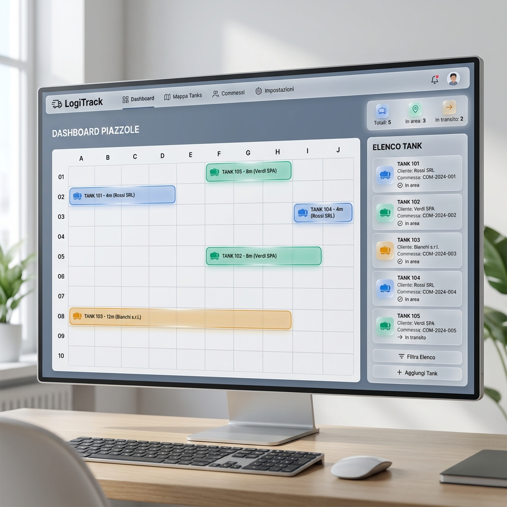
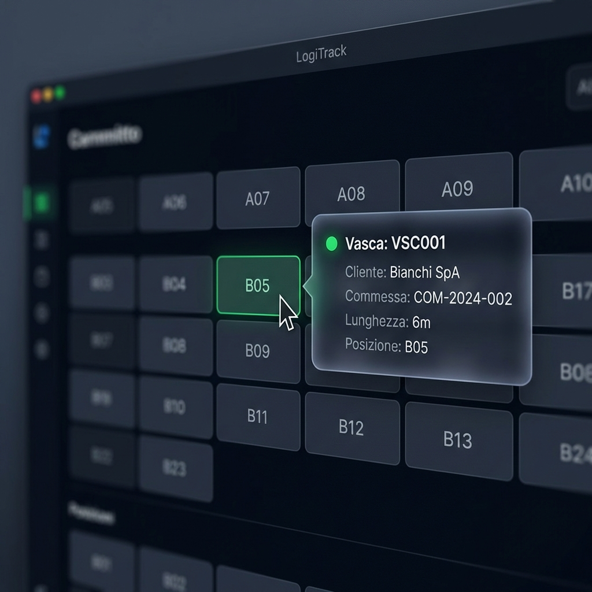
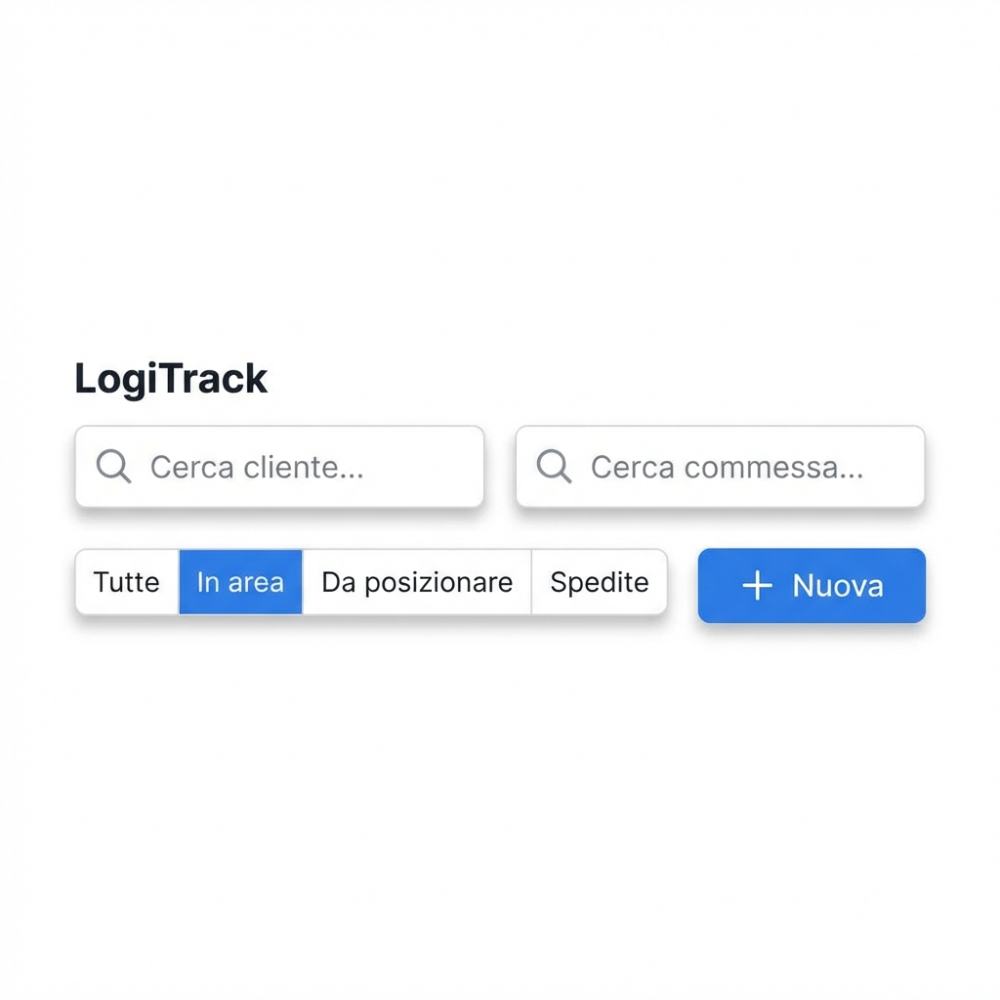
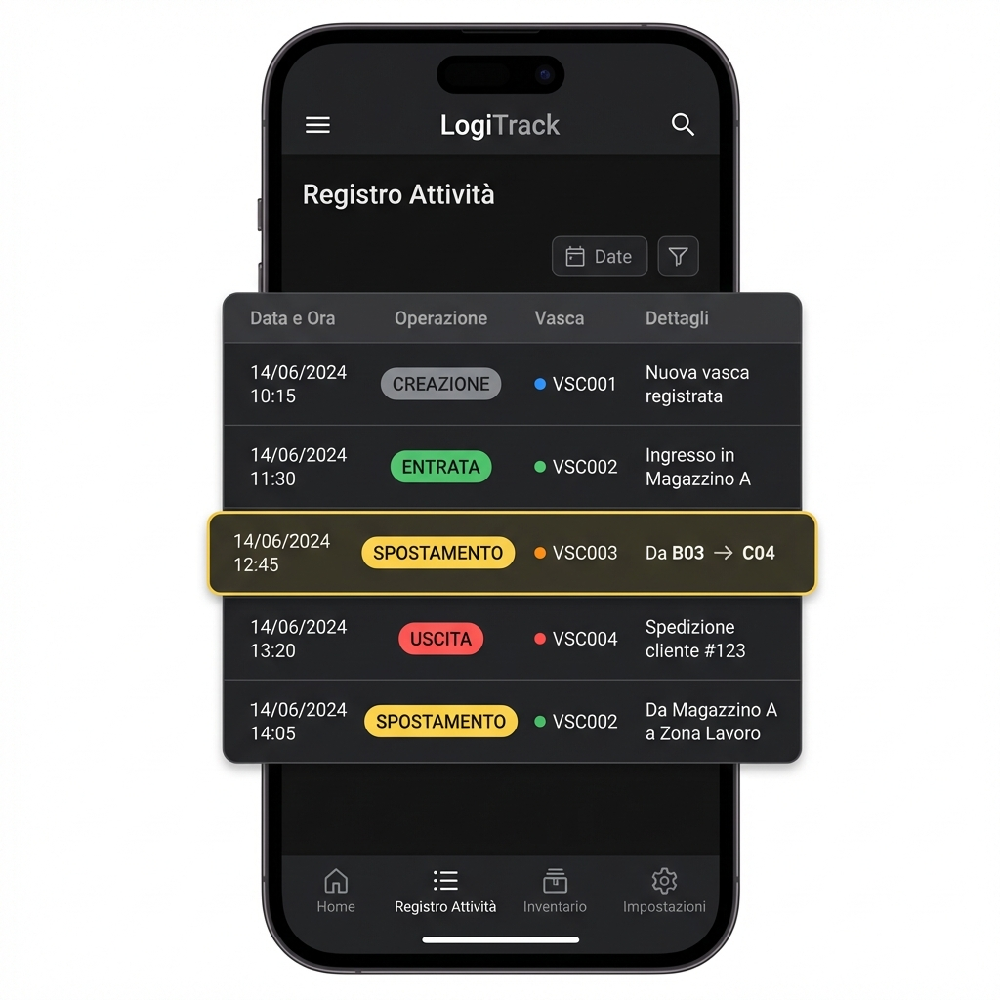

# Presentazione Progetto: LogiTrack - Gestione Vasche

## 1. Esigenze del Cliente
Il cliente necessita di un sistema centralizzato per:
*   **Monitoraggio Real-time**: Visualizzare la posizione esatta di ogni vasca all'interno dell'area di stoccaggio (piazzole).
*   **Ottimizzazione dello Spazio**: Gestire vasche di diverse lunghezze, assicurando che non ci siano sovrapposizioni e che lo spazio sia utilizzato in modo efficiente.
*   **Ricerca Avanzata**: Facilitare il reperimento rapido delle vasche tramite filtri per **Cliente** e **Commessa**.
*   **Tracciabilità**: Mantenere un registro storico di tutte le operazioni di creazione, posizionamento, spostamento e scarico.

## 2. Soluzione Progettata
La soluzione **LogiTrack** offre un'interfaccia web moderna e intuitiva:
*   **Planimetria Interattiva**: Una griglia dinamica che rappresenta l'area di stoccaggio. Ogni cella corrisponde a un'unità di spazio (slot).
*   **Visualizzazione Dinamica**: Le vasche sono colorate per una distinzione visiva immediata e occupano un numero di slot proporzionale alla loro lunghezza.
*   **Gestione Assistita**: Durante il posizionamento, il sistema evidenzia le aree disponibili, prevenendo errori umani di sovrapposizione.

## 3. Caratteristiche Funzionali
*   **Visualizzazione Hover**: Passando il mouse sopra una vasca nella griglia, appare istantaneamente un tooltip con i dettagli: Codice, Cliente, Commessa e Lunghezza.
*   **Dual Search**: Due campi di ricerca indipendenti permettono di filtrare la flotta vasche per Cliente e per numero di Commessa simultaneamente.
*   **Integrazione Registro**: Ogni azione è loggata automaticamente con timestamp, permettendo audit e analisi storiche.
*   **Persistenza Dati**: Il sistema memorizza lo stato delle vasche e il registro localmente, garantendo la continuità del lavoro anche dopo la chiusura del browser.

## 4. Esperienza Utente (Anteprima Interfaccia)

Di seguito grafiche esemplificative che illustrano la potenza e la semplicità della soluzione proposta:

### Dashboard e Planimetria

*Dashboard principale con vista d'insieme degli spazi e stati delle vasche.*

### Dettagli in Hover

*Tooltip dinamico che mostra istantaneamente i dettagli al passaggio del mouse.*

### Filtri e Ricerca

*Sistema di ricerca duale (Cliente/Commessa) con filtri di stato rapidi.*

### Registro Attività

*Tracciabilità totale tramite il registro delle operazioni con badge di stato.*

---
*LogiTrack - Efficienza nella dislocazione industriale.*
